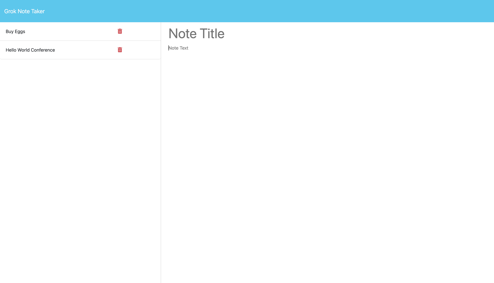

# Grok_Note_Taker

## Description
Grok Note Taker is a web application that allows users to create, view, and manage notes, enabling users to easily add, read, and delete notes in a user friendly environment. 

## Table of Contents
- [Description](#description)
- [Installation](#installation)
- [Usage](#usage)
- [Contribution](#contribution)
- [Tests](#tests)
- [License](#license)
- [Questions](#questions)

## Installation
Clone this repository to your local machine. Navigate to the project directory and run 'npm install' to install all necessary dependencies.

## Usage
1. On the landing page, click on the "Get Started" button to navigate to the notes page.
2. On the notes page, you will see a list of existing notes in the left-hand column.
3. To create a new note, enter a note title and text in the right-hand column. When you start typing, the "Save Note" and "Clear Form" buttons will appear.
4. Click the "Save Note" button to save the note. The note will appear in the list of existing notes.
5. To view an existing note, click on the note in the left-hand column. The note's details will appear in the right-hand column.
6. To delete a note, click the trash icon next to the note in the list.

## Contribution
Contributions to enhance the functionality of Grok Note Taker are welcome. Please fork the repo, create a new branch, commit your changes, and open a pull request.

## Tests
To run the tests, install Jest via 'npm install jest' and then run 'npm run test'. Ensure that your contributions pass all tests before submitting a pull request.

## License
This project is licensed under the MIT license. [License Link](https://choosealicense.com/licenses/mit/)

## Questions
For any questions, please contact me at [piattiehadi@yahoo.com](mailto:piattiehadi@yahoo.com).

GitHub Profile: [Piattiehadi](https://github.com/Piattiehadi)